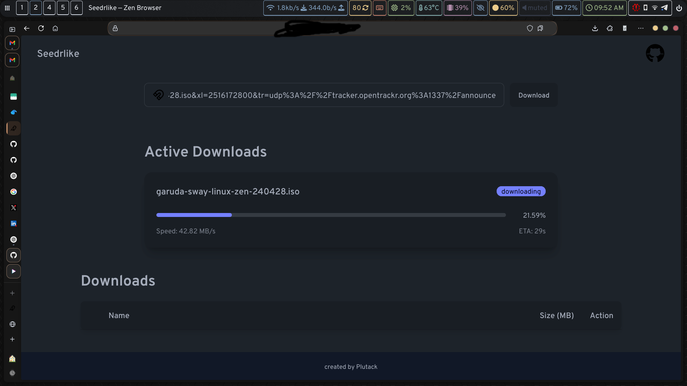
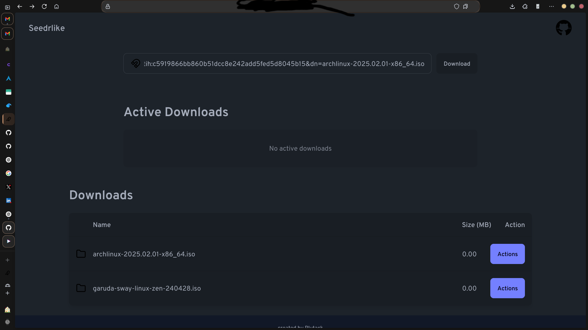

<p align="center">
    
</p>
<p align="center"><h1 align="center">SEEDRLIKE</h1></p>
<p align="center">
</p>
<p align="center">
	
	
	
	
</p>
<p align="center"><!-- default option, no dependency badges. -->
</p>
<p align="center">
	<!-- default option, no dependency badges. -->
</p>
<br>

## Table of Contents

- [Overview](#overview)
- [Features](#features)
- [Project Structure](#project-structure)
- [Getting Started](#getting-started)
  - [Prerequisites](#prerequisites)
  - [Installation](#installation)
  - [Usage](#usage)
  - [Live app](#live-app)
- [Project Roadmap](#project-roadmap)
- [Contributing](#contributing)
- [License](#license)
- [Acknowledgments](#acknowledgments)

---

##  Overview
Seedrlike is inspired by [Seedr](https://seedr.cc). This allows the user to add magnet links to which in turn makes them available for download over https.

---

##  Features
- Initiate downloads using magnet links
- Websocket for real time updates (tracking download progress and time to complete)

---

##  Project Structure

```sh
└── seedrlike/
    ├── Dockerfile
    ├── cmd
    │   └── main.go
    ├── generate.go
    ├── go.mod
    ├── go.sum
    ├── internal
    │   ├── api
    │   ├── core
    │   └── database
    ├── seedrlike
    ├── sqlc.yaml
    ├── tailwind.config.js
    └── views
        ├── assets
        ├── components
        └── layouts
```


---
##  Getting Started

###  Prerequisites

Before getting started with seedrlike, ensure your runtime environment meets the following requirements:

- **Programming Language:** Go
- **Package Manager:** Go modules
- **Container Runtime:** Docker


###  Installation

Install seedrlike using one of the following methods:

**Build from source:**

1. Clone the seedrlike repository:
```sh
❯ git clone https://github.com/plutack/seedrlike
```

2. Navigate to the project directory:
```sh
❯ cd seedrlike
```

3. Install the project dependencies:


**Using `go modules`** &nbsp; [](https://golang.org/)

```sh
❯ go build
```


**Using `docker`** &nbsp; [](https://www.docker.com/)

```sh
❯ docker build -t {image_name} .
```


###  Usage
Run seedrlike using the following command:
**Using `go modules`** &nbsp; [](https://golang.org/)

```sh
❯ go run ./cmd/main.go
```


**Using `docker`** &nbsp; [](https://www.docker.com/)

```sh
❯ docker run -it -p 3000:3000 {image_name}
```

### Live-app




---
##  Project Roadmap

- [X] **`Task 1`**: <strike>Fix bug: websocket complete event is not sent sometimes</strike>
- [ ] **`Task 2`**: Bug: Fix file display size.
- [ ] **`Task 3`**: Feat:Add test files.
- [ ] **`Task 4`**: Feat: Keep track of file status during upload stage and send websocket events based on them.

---

##  Contributing

- **💬 [Join the Discussions](https://github.com/plutack/seedrlike/discussions)**: Share your insights, provide feedback, or ask questions.
- **🐛 [Report Issues](https://github.com/plutack/seedrlike/issues)**: Submit bugs found or log feature requests for the `seedrlike` project.
- **💡 [Submit Pull Requests](https://github.com/plutack/seedrlike/blob/main/CONTRIBUTING.md)**: Review open PRs, and submit your own PRs.

<details closed>
<summary>Contributing Guidelines</summary>

1. **Fork the Repository**: Start by forking the project repository to your github account.
2. **Clone Locally**: Clone the forked repository to your local machine using a git client.
   ```sh
   git clone https://github.com/plutack/seedrlike
   ```
3. **Create a New Branch**: Always work on a new branch, giving it a descriptive name.
   ```sh
   git checkout -b new-feature-x
   ```
4. **Make Your Changes**: Develop and test your changes locally.
5. **Commit Your Changes**: Commit with a clear message describing your updates.
   ```sh
   git commit -m 'Implemented new feature x.'
   ```
6. **Push to github**: Push the changes to your forked repository.
   ```sh
   git push origin new-feature-x
   ```
7. **Submit a Pull Request**: Create a PR against the original project repository. Clearly describe the changes and their motivations.
8. **Review**: Once your PR is reviewed and approved, it will be merged into the main branch. Congratulations on your contribution!
</details>


---

##  License

This project is protected under the [GLWTS Public License](./LICENSE.md) License. 

---

##  Acknowledgments

- @Melkeydev - [go-blueprint](https://github.com/Melkeydev/go-blueprint)
- @anacrolix - [anacrolix/torrent](https://github.com/anacrolix/torrent)

---
